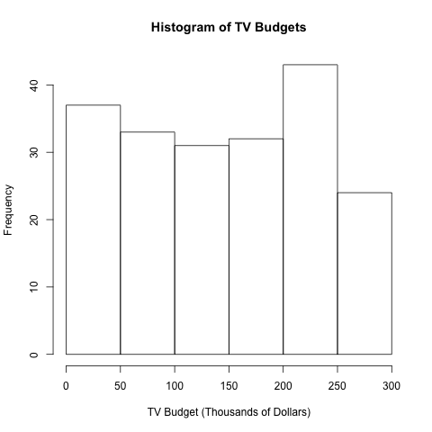
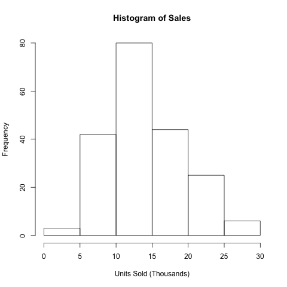

```{r, echo=FALSE, message=FALSE}
#Calling package for later use
library(xtable)

```
#Abstract
This report reproduces the Advertising data visualization found in section 3.1 **Simple Linear Regression** of *An Introduction to Statistical Learning*. The concepts addressed in this assignment were using command line Rscripts and file output in R.

#Introduction
The Advertising data set explores the relationship between advertising budgets for different appliances and the resulting sales. This report conducts simple regression analysis to predict expected sales values as a function of TV advertising budget. 

#Data
below is the table summarizing the Advertising data set:
```{r,echo=FALSE,results='asis'}
load('../data/eda-output.txt')
xtable(combined_summary,caption='Summary Statistics for Advertising')
```

Below are the histograms for TV budget and Sales: 
```{r,out.width = '200px', echo=FALSE, message=FALSE, fig.align='center', eval=TRUE,split=TRUE}


par(mfrow = c(1,2))
```

#Methodology
To use TV budget to predict sales, we use the following linear model:

$$Sales = \beta_{0} + \beta_{1}TV$$

This linear model uses a least squares regression to minimize expected error. $\beta_{1}$ corresponds to the correlation bettween *Sales* and *TV* so a larger $\beta_{1}$ indicates a strong, direct relationship between the two.

To assess whether *Sales* and *TV* influence each other we establish the null hypothesis that *TV8 does not affect *Sales* and the alternative hypothesis is that *TV* does affect *Sales*.

#Results
By fitting the Advertising data to a linear model we can find the regression coefficients:

```{r,echo=FALSE,results='asis',warning=FALSE}
load('../data/regression.rData')
lm_summary = summary(fit)
xtable(lm_summary$coefficients,caption='Information about Regerssion Coefficients')
```

We can use the intercept and slope coefficients found from this table to graph the least squares regression line between Sales and TV. From the p-values displayed we can reject the null hypothesis and conclude that *TV* does affect *Sales*.

Here is additional information regarding the least squares model:

```{r,echo=FALSE,results='asis',warning=FALSE}
table2 = matrix(nrow=3,ncol=2)
Quantity = c('RSS','R2','F-stat')
Value = c(lm_summary$sigma,lm_summary$r.squared,lm_summary$fstatistic[1])
table2[,1] = Quantity
table2[,2] = Value
colnames(table2) = c('Quantity', 'Value')
xtable(table2,caption='Regression Quality Indices')
```

Values of interest from **Table 2** are the Residual Sum of Squares and the $R^2$ values. Because these values are small, linear regression is an appropriate fit for the Advertising data.

We can synthesize all of this information into the scatter plot representing the relationship between *Sales* and *TV*

```{r,out.width='300px',echo=FALSE,message=FALSE,fig.align='center'}
knitr::include_graphics('../images/scaterplot-tv-sales.png')
```

#Conclusion

From the analysis in **Results** and from an informal analysis of the scatterplot we can see that *TV* does have an effect on *Sales*. This linear model can be used by marketing managers to determine how much they want to invest in TV advertising to achieve a desired level of sales.